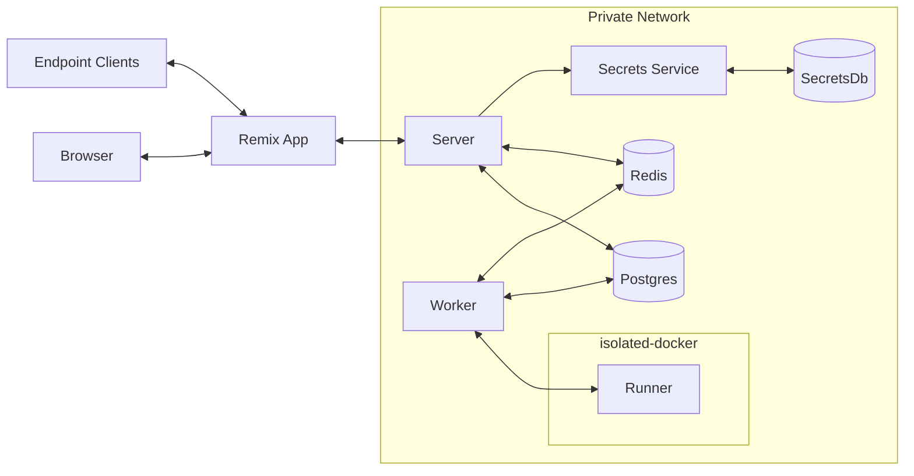

> **Warning**
> This project is very much an unstable work in progress. Follow along on [my blog](https://offbyone.us/tags/micro-business/) to see my process.

## What is WebReducer

WebReducer is the simplest way to get a stateful endpoint online. You define a few functions that configure the behavior of your endpoint and we handle the rest. You can think of it like an HTTP endpoint + Redux reducer, if that makes any sense to you.

Here's a pseudo-code version of how WebReducer works:

```js
server.on("request", async (req, res) => {
  const yourResponse = yourResponderFunction(req.body);
  res.status(yourResponse.statusCode);
  res.send(yourResponse.body);
  const currentState = await lookupCurrentState();
  const yourSecrets = await lookupYourSecrets();
  const nextState = yourReducerFunction(currentState, req.body, yourSecrets);
  await saveNextState(nextState);
});
```

In reality, it's a lot more complex than this. But this can give you an adequate mental model of the system

## Service Level Diagram



## Use cases

(this is an active brainstorm)

- Prototyping
  - Often times when you're working on a new project, it's somewhere between prototype and production application. Maybe you don't have as many tests as you normally would. Maybe you don't have as much observability as you might want. _Maybe you don't handle webhooks all that well_. Start with hook reducer. Put it in front of your project.
  - Maybe you have a new integration in your product. It's immature, and you're not sure if it'll stick around. They have a webhook feature, but you don't want to do the legwork to setup a queue, validate authenticity, etc, etc, etc. Put WR in front of your app. Write your reducer function later if you ever need it.
  - Your building a client-side prototype and don't want to bother with a real backend, but would love to save a little data somewhere. We've got you covered
- IOT
  - Do you have devices out in the world that are intermittently connected? Maybe you want them to be able to connect to a server and ask "what happened since I last had a connection." WR is perfect for that.
- Games
  - You want multiple players to agree on the state of the world
  - Multiple players can send in events
  - All players are notified via websocket when the state of the world changes
- Debugging

  - ??

- Personal
  - I want to expose a read endpoint that tells my friends how many unread messages are in my gmail inbox
    - https://developers.google.com/gmail/api/guides/push?utm_campaign=io15&utm_source=gadbc&utm_medium=blog
  - something similar to above with calendar
  - my internet quality idea
  - my sleep tracker idea

## Hygen templates

```sh
$ hygen new worker|email|etc
```

## Maintenance

- [ ] Upgrade packages in every js project
- [ ] For docker images
  - [ ] `docker pull node:lts-alpine`
  - [ ] Take out the digest and put it in the [docker](./runner/Dockerfile) [files](./server/Dockerfile)

## 2/27/22

- Auth should not be in authn
- we should use our own stuff
- every request sends a auth header
  - auth header is base64 encoded json
  - it contains
    - a visitor id
    - conditionally a jwt.
  - many routes will be able to be hit w/ just a visitor id
  - upon authentication, everything the visitor owns will be merged with the prior user
  - modeling visitors
    - maybe a user with type = visitor? <-- that one
    - maybe its own table, with a userid column
  - authentication happens via email
    - we sign a jwt when we see a req with a preapproved code
    - that code is sent via email
    - modeling login tokens
      - table for login tokens
      - expiry = 1h
    - able to set a pin on acct if you want
  - req.user will always be defined, even if there's no jwt
  - when you login with an email link, you get a jwt, and your visitor id is updated
  - if you try to use a uuid that is a non-visitor id (already tied to an account), but you don't have a jwt, you are denied
- Capabilities we need
  - reading and writing auth header
  - sending email
  - storing login tokens

## 3/6/22 state dump

- [x] email queue system (https://github.com/forwardemail/email-templates)

## 3/28/22

- Auth layer is sort of working!
- Made some changes to above.
  - instead of using unsigned jwt for visitors, we hit an endpoint to sign up a new visitor
  - this is because i thought it could be a single point to eliminate abuse (block signups from ip, capcha, etc)
  - some integration tests of access and auth
- ran security & dependency updates
- considering doing the FE in remix and hitting the express API from backend to backend

## 4/1/22

- Refresh tokens seem to be working ok
- next up is probably publishing draft

## 4/4/22

- [CloudEvents](https://cloudevents.io/) are a spec for various event types... I think that should be used instead of our request schema.
