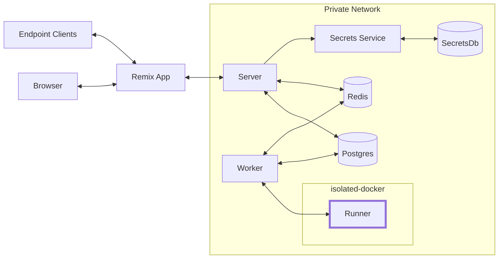

# Runner

```mermaid
flowchart LR
    Client[Remix App]
    Browser
    HookClient[Endpoint Clients]
    subgraph privateNetwork[Private Network]

        Server
        Redis[(Redis)]
        Postgres[(Postgres)]
        SecretsDb[(SecretsDb)]
        Worker
        Secrets[Secrets Service]
        subgraph isolated-docker
            Runner
        end
    end

    click Client "https://github.com/zekenie/web-reducer/tree/main/client#readme"
    click Server "https://github.com/zekenie/web-reducer/tree/main/server#readme"
    click Worker "https://github.com/zekenie/web-reducer/tree/main/server#readme"
    click Secrets "https://github.com/zekenie/web-reducer/tree/main/secrets#readme"
    click Runner "https://github.com/zekenie/web-reducer/tree/main/runner#readme"


    Client <--> Server
    Server --> Secrets
    HookClient <--> Client
    Secrets <--> SecretsDb
    Server <--> Redis
    Server <--> Postgres
    Worker <--> Redis
    Worker <--> Postgres
    Worker <--> Runner
    Browser <--> Client
    Redis

classDef selected stroke-width:4px;
class Runner selected;
```
