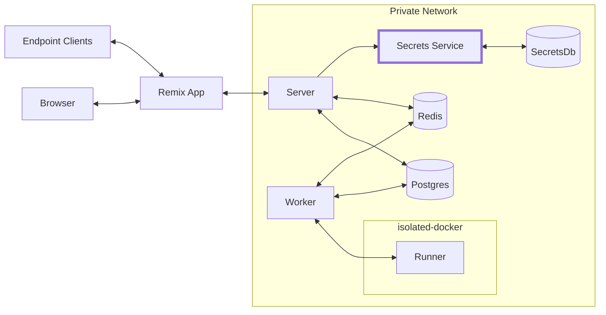

# Secret service 👩‍✈️👨‍✈️



The purpose of this service is to hold onto customer secrets. This application is not on the open internet.

## Concepts

Secrets are organized into namespaces. A namespace is essentially a collection of secrets. `Secret ⤚ Namespace`. When you create a namespace with the API, you get back an access key you can save. You can perform CRUD operations on secrets in that namespace and retrieve the secrets. This key is hashed in Secret Service and cannot be recreated. It is intended that this key is encrypted when it is stored.

### Example of creating a namespace:

```
> POST /namespaces HTTP/2
> ...
> Content-Type: application/json
>

< HTTP/2 201 OK
< ...
< Content-Type: application/json
<

{
  "accessKey": "Uakgb_J5m9g-0JDMbcJqLJ"
}
```

### Example of adding/updating a secret

```
> POST /namespaces/Uakgb_J5m9g-0JDMbcJqLJ HTTP/2
> ...
> Content-Type: application/json
>
{
  "key": "SECRET_API_KEY",
  "value: "foobar"
}

< HTTP/2 201 OK
< ...
< Content-Type: application/json
<

```

### Reading secrets in namespace

```
> GET /namespaces/Uakgb_J5m9g-0JDMbcJqLJ HTTP/2
> ...
> Content-Type: application/json
>

< HTTP/2 200 OK
< ...
< Content-Type: application/json
<

{
  "SECRET_API_KEY": "foobar"
}
```

## Internal security

- This service is not on the open internet
- All requests to this service require a secret key auth header (shared)
- Namespace names are non-guessable. In order to find secrets for a hook, you'd need to know the association between `hookId` and `namespaceId`. You'd also need to know the secret key, which is encrypted, so you'd need access to the environment variables of the main server.
- Secrets are not stored in plain text, they are encrypted. Each namespace has an encryption key. These keys are themselves encrypted with an environment variable (`KEY_ENCRYPTION_KEY`). This means if the db is leaked, it's useless without the env var.
